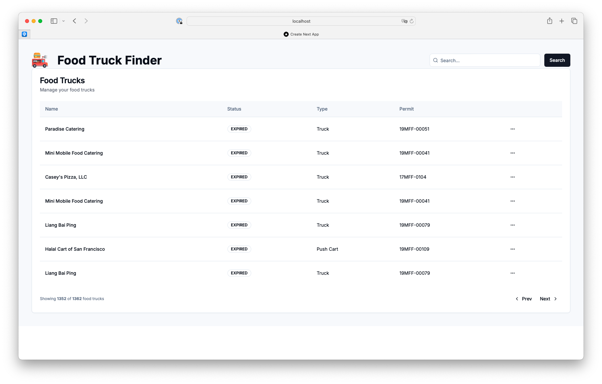

# Solution - Food Truck Permit Finder


[vercel deploy](https://engineering-assessment-alpha.vercel.app)

This project involves creating a website and a backend API using NextJS Server Actions. The goal is to provide a modern user interface and a robust API to manage mobile food facility permits.


## Tools
- **NextJS**: Used for both frontend and backend.
- **React**: JavaScript library for building user interfaces.
- **Tailwind CSS**: CSS library for styling the frontend.
- **Shadcn/ui**: UI components.
- **SQLite**: Database used to store permit data.


## Project Description

The project takes information from a CSV file (`Mobile_Food_Facility_Permit.csv`) and loads it into a local SQLite database. This database is located at `prisma/dev.db` and is used solely to facilitate running the project for evaluation purposes.

## Prisma Configuration

The Prisma schema is defined in the `schema.prisma` file, and the CSV data is loaded into the database using a seed script (`seed.ts`).

## How to Run

### Prerequisites

- Node.js installed on your machine.
- Project dependencies installed (run `npm install`).

### Steps to Run

1. **Navigate to the project directory**:
```bash
    cd food-truck
```

2. **Install dependencies:**:
   
```bash
   npm install
```

3. **Build the project:**:
   
```bash
   npm run build
```

4. **Build the project:**:
   
```bash
   npm run start
```

### Additional Notes
- The SQLite database is used solely to facilitate running the project for evaluation purposes.
- Ensure that the Mobile_Food_Facility_Permit.csv file is in the root of the project or adjust the path in the seed script as necessary.

## Seeding the Database
To seed the database with data from the CSV file, follow these steps:

1. **Generate Prisma Client:**:
```bash
    npx prisma generate
```
2. **Generate Prisma Client:**:
```bash
    npx prisma migrate dev --name init
```

3. **Run the seed script:**:
```bash
    npx tsx prisma/seed.ts
```


## Contributions
Contributions are welcome. Please open an issue or a pull request to discuss any changes you would like to make.